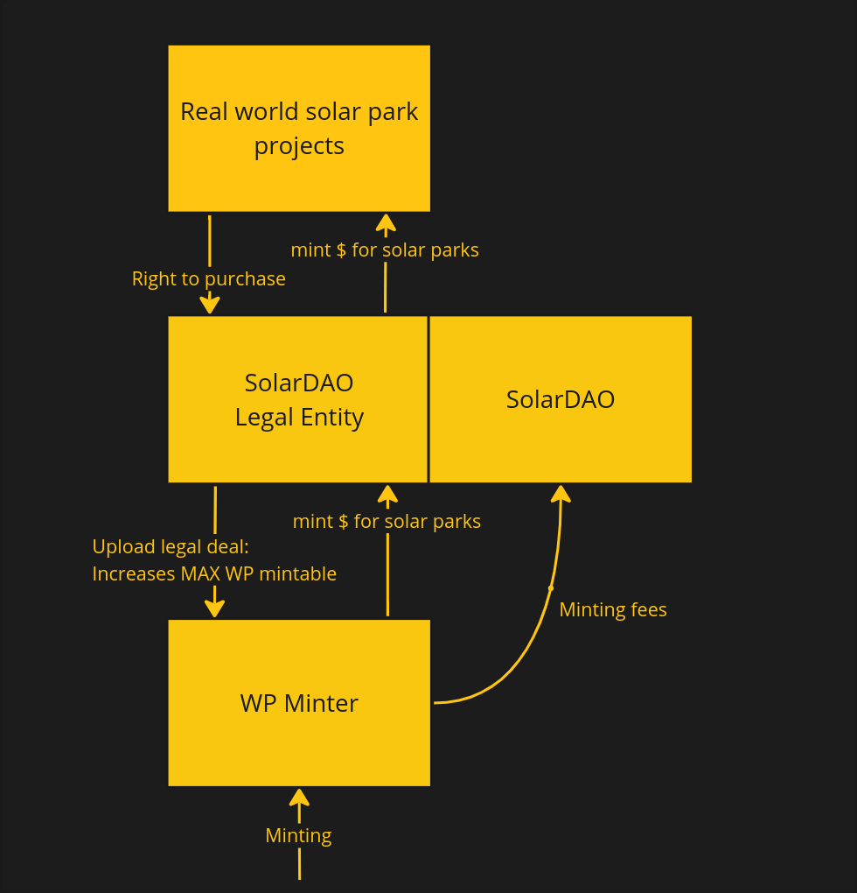
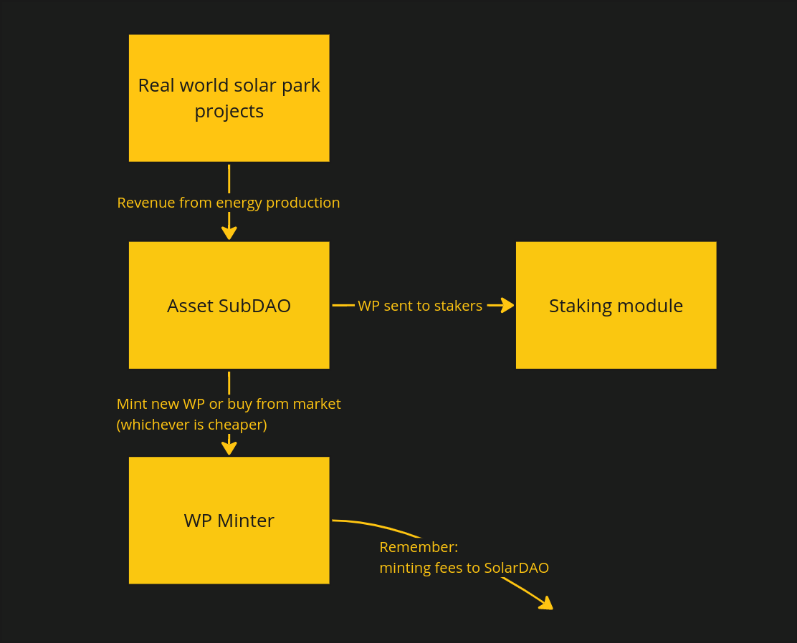

# WattPeak

This is the WattPeak monorepo. It contains all the smart contracts related to the WattPeak minter and staking module, 
as well as the frontend(s) for the WattPeak dApp.

## What is WattPeak?
WattPeak is a new revolutionary stable token technology that help speed up the shift to renewable and green energy by actively crowdsourcing new solar energy production around the world.

Each WattPeak token represents 1 Watt-peak (Wp) of grid-connected solar energy production capacity. 
The tokens are backed by real solar energy production capacity and furthermore, the $WP token offers a real yield to users 
by using the revenue from the solar energy production to mint, or buy back from the market, wattpeak tokens which are distributed to stakers.

## How does it work?

What is explained here is the go-to-market design. The design relies upon certain manual processes that will be automated in the future
through smart contracts and oracles.

For WattPeak to work there are multiple components and actors involved.

### WattPeak minter

The WattPeak minter is the smart contract that controls the minting of new WattPeak tokens. 
It is owned and governed by the SolarDAO.

Before any WattPeak can be minted, the contract needs Projects with available capacity to be uploaded.

Projects are real-world solar projects in which the WattPeak minter has been given purchasing rights.
Minting 1 WattPeak tokens means 1 watt-peak of solar energy production capacity is purchases from one of the 
available Projects.

The minting cost (minus fees) are sent to the legal entity in charge of buying the production capacity.
Fees for minting WattPeak are sent to the SolarDAO.

